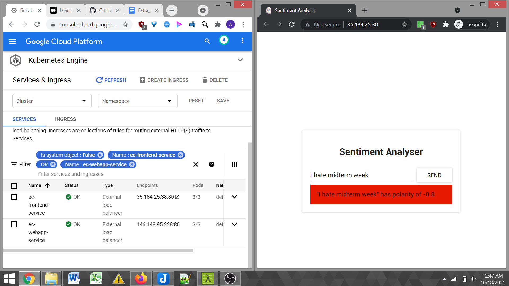

# CS1660_MiniProject
A microservice-based sentimental analysis app using Google Kubernetes Engine.

## Screenshot of Application and GKE

## Docker Hub Images

### Frontend
https://hub.docker.com/r/amw8711/sentiment-analysis-frontend

*Tag `gcp` contains the necessary change that contains the external URL to access the webapp.*

### Logic
https://hub.docker.com/r/amw8711/sentiment-analysis-logic

### Webapp
https://hub.docker.com/r/amw8711/sentiment-analysis-webapp

## Steps for Google Kubernetes Engine
- Download the code locally from https://github.com/rinormaloku/k8s-mastery/
- For the Frontend:
	- Within its directory and with npm installed, run  `npm install` and `npm run build`
	- Within its directory, build the docker image for the frontend with `docker build -f Dockerfile -t $DOCKER_USER_ID/sentiment-analysis-frontend .`
	- Within its directory, push the built image to Docker Hub with `docker push $DOCKER_USER_ID/sentiment-analysis-frontend`
- For the Webapp:
	- Within its directory and with JDK8 and Maven (mvn) installed, run `mvn install` 
	- Within its directory, build the docker image for the frontend with `docker build -f Dockerfile -t $DOCKER_USER_ID/sentiment-analysis-webapp .`
	- Within its directory, push the built image to Docker Hub with `docker push $DOCKER_USER_ID/sentiment-analysis-webapp`
- For the Logic:
	- Within its directory and with Python and PIP installed, run `python -m pip install -r requirements.txt` and `python -m textblob.download_corpora`
	- Within its directory, build the docker image for the frontend with `docker build -f Dockerfile -t $DOCKER_USER_ID/sentiment-analysis-logic .`
	- Within its directory, push the built image to Docker Hub with `docker push $DOCKER_USER_ID/sentiment-analysis-logic`
- For all 3 of the newly created docker images, add them to Google's Container Registry
	- Using the Cloud Shell on https://console.cloud.google.com/ , pull the Docker image to the VM (example: `docker pull amw8711/sentiment-analysis-frontend:gcp`)
	- Using the Cloud Shell, tag the image for the Container Registry (example: `docker tag amw8711/sentiment-analysis-frontend:gcp us.gcr.io/cs-1660/ec-frontend:gcp`) 
	- Using the Cloud Shell, push the tagged image to the Container Registry (example: `docker push us.gcr.io/cs-1660/ec-frontend:gcp`)
- Create a cluster for each image. Done through the GCP website: Left Navigation Menu > Kubernetes Engine > Clusters. Create and configure a GKE standard cluster.
- Deploy the images to the cluster. Done through the GCP website: Clusters > Deploy. Edit the containers with an Existing container image with the ones pushed to the registry.
- Expose the images to make them externally available both to each other and to the public. Done through the GCP website: Kubernetes Engine > Workloads. Click on each deployment's name. Under Actions > Expose to create a Load Balancer or other service. Both the frontend and webapp require a load balancer and external IP.
- Update the frontend to use the external IP for the backend webapp. Get the external IP for the webapp (Done through the GCP website: Kubernetes Engine > Services. Use the endpoint defined for the webapp) Within the downloaded `App.js` file, within Class App's `analyzeSentence()` method, replace `localhost:8080` with the IP for the webapp. Go through the steps of building the app, building the Docker image, and pushing to Docker Hub and Google Container Registry.  Ensure the frontend service is using this new image by updating the frontend deployment's YAML file (Done through the GCP website: Kubernetes Engine > Workloads. Click on deployment name and edit, and find and change the image definition. example: `image: us.gcr.io/cs-1660/ec-frontend:gcp@sha256:...`) 
 
## Video Demo and Code Walkthrough

